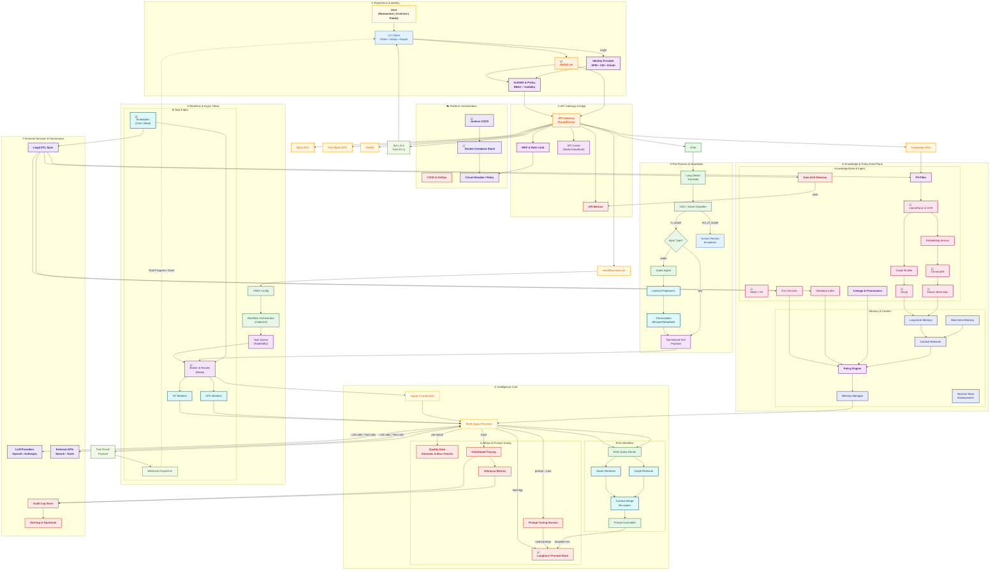

%% Improved Multi-Agent RAG Architecture (Updated)
%% config:
%%   layout: elk
%%   theme: forest

```mermaid
flowchart TB

  %% ─────────────────────────────────────────────
  %% Custom Class Styles (vibrant palette)
  %% ─────────────────────────────────────────────
  classDef user      fill:#FFFAE5,stroke:#FFB300,stroke-width:2px,color:#333,font-weight:bold;
  classDef business  fill:#E3F2FD,stroke:#1976D2,stroke-width:1.5px,color:#0D47A1;
  classDef gateway   fill:#FFF3E0,stroke:#FB8C00,stroke-width:2px,color:#E65100,font-weight:bold;
  classDef router    fill:#E8F5E9,stroke:#388E3C,stroke-width:2px,color:#1B5E20;
  classDef queue     fill:#F3E5F5,stroke:#8E24AA,stroke-width:2px,color:#4A148C;
  classDef worker    fill:#E0F7FA,stroke:#006064,stroke-width:2px,color:#004D40;
  classDef agent     fill:#FFFDE7,stroke:#FBC02D,stroke-width:2px,color:#F57F17,font-weight:bold;
  classDef memory    fill:#E8EAF6,stroke:#3949AB,stroke-width:2px,color:#1A237E;
  classDef kb        fill:#FCE4EC,stroke:#C2185B,stroke-width:2px,color:#880E4F;
  classDef endpoint  fill:#FFF8E1,stroke:#FFA000,stroke-width:2px,color:#E65100;
  classDef response  fill:#F1F8E9,stroke:#689F38,stroke-width:2px,color:#33691E;
  classDef svc       fill:#EDE7F6,stroke:#5E35B1,stroke-width:2px,color:#311B92,font-weight:bold;
  classDef ops       fill:#FBE9E7,stroke:#D84315,stroke-width:2px,color:#B71C1C,font-weight:bold;
  classDef policy    fill:#F3E5F5,stroke:#6A1B9A,stroke-width:2px,color:#4A148C,font-weight:bold;

  %% =========================
  %% 0. Platform Orchestration
  %% =========================
  subgraph SG_PLAT["☁️ Platform Orchestration"]
    JENKINS["<img src='https://upload.wikimedia.org/wikipedia/commons/e/e9/Jenkins_logo.svg' width='40'/> Jenkins CI/CD"]:::svc
    DOCKER["<img src='https://www.docker.com/wp-content/uploads/2022/03/vertical-logo-monochromatic.png' width='40'/> Docker Compose Stack"]:::svc
    CI_CD["CI/CD & GitOps"]:::ops
    CB["Circuit Breaker / Retry"]:::svc
  end
  JENKINS --> DOCKER --> CB

  %% =========================
  %% 1. Experience & Identity
  %% =========================
  subgraph SG_CLIENT["① Experience & Identity"]
    U0["User<br>(Researcher | Archivist | Public)"]:::user
    UI0["UI / Client<br>Filters • Status • Export"]:::business
    LB["<img src='https://blog.pixelfreestudio.com/wp-content/uploads/2024/08/Nginx_server-optimized.jpg'/> NGINX LB"]:::gateway
    AUTHZ["AuthN/Z & Policy<br>RBAC • Visibility"]:::policy
    IDP["Identity Provider<br>SPID • CIE • OAuth"]:::policy
  end
  U0 --> UI0 --> LB --> AUTHZ --> G
  UI0 -->|Login| IDP
  IDP --> AUTHZ

  %% =========================
  %% 2. API Gateway & Edge
  %% =========================
  subgraph SG_GATEWAY["② API Gateway & Edge"]
    G["API Gateway<br>(Kong/Envoy)"]:::gateway
    WAF["WAF & Rate Limit"]:::policy
    CACHE["API Cache<br>(Redis/Cloudfront)"]:::queue
    MON["API Metrics"]:::ops
  end
  LB --> G --> WAF --> CB
  G --> CACHE
  G --> MON
  G --> H["/chat"]:::router
  G --> WF_EP["/workflows/execute"]:::endpoint
  G --> KAPI["Knowledge APIs"]:::endpoint
  G --> MGMT["Mgmt APIs"]:::endpoint
  G --> TASKAPI["Task Mgmt APIs"]:::endpoint
  G --> MON1["/health"]:::endpoint
  G --> TASKIDS["Sync Ack<br>Task IDs []"]:::response --> UI0

  %% =========================
  %% 3. Pre-Processing & Guardrails
  %% =========================
  subgraph SG_PRE["③ Pre-Process & Guardrails"]
    LANG["Lang Detect<br>Translate"]:::router
    OOC["OOC / Intent Classifier"]:::router
    I{"Input Type?"}:::router
    M["Normalized Text<br>Payload"]:::queue
    HUMAN["Human Review<br>Escalation"]:::business
    AUD["Audio Ingest"]:::router
    LIB["Librosa Preprocess"]:::worker
    TR["Transcription<br>Whisper/DeepSeek"]:::worker
  end
  H --> LANG --> OOC
  OOC -- out_of_scope --> HUMAN
  OOC -- in_scope --> I
  I -- audio --> AUD --> LIB --> TR --> M
  I -- text --> M


  %% =========================
  %% 4. Workflow & Async Fabric
  %% =========================
  subgraph SG_WF["④ Workflow & Async Fabric"]
    WF_CFG["YAML Config"]:::router
    WF_ORCH["Workflow Orchestrator<br/>(Cadence)"]:::router
    SUBQ["Task Queue<br/>(RabbitMQ)"]:::queue
    subgraph CELERY["⛓️ Task Fabric"]
      BROKER["<img src='https://w7.pngwing.com/pngs/428/940/png-transparent-logo-redis-redis-icon-thumbnail.png'/> Broker & Results<br/>(Redis)"]:::queue
      CW_IO["I/O Workers"]:::worker
      CW_CPU["CPU Workers"]:::worker
      BEAT["<img src='https://www.mattlayman.com/img/2019/celery.png'/> Schedulers<br/>(Cron / Beat)"]:::worker
      WHB["Webhook Dispatcher"]:::response
    end
  end
  WF_EP --> WF_CFG --> WF_ORCH --> SUBQ
  SUBQ --> BROKER
  M --> BROKER
  BROKER --> CW_IO
  BROKER --> CW_CPU
  BEAT --> BROKER
  CW_IO --> P
  CW_CPU --> P
  WHB -.->|Task Progress / Done| UI0

  %% =========================
  %% 5. Intelligence Core
  %% =========================
  subgraph SG_INTEL["⑤ Intelligence Core"]
    Coordinator["Agent Coordinator"]:::agent
    P["Multi-Agent Runtime"]:::agent

    subgraph SG_OPS["LLMOps & Prompt Tuning"]
      LANGFUSE["<img src='https://images.seeklogo.com/logo-png/61/2/langfuse-logo-png_seeklogo-611659.png'/> Langfuse / Prompt Store"]:::ops
      PTUNE["Prompt Tuning Service"]:::ops
      QGATE["Quality Gate<br/>Semantic & Bias Checks"]:::ops
      TRACE["Distributed Tracing"]:::ops
      METRICS["Inference Metrics"]:::ops
    end

    subgraph SG_RAG["RAG Workflow"]
      RAG_Q["RAG Query Router"]:::router
      RAG_VEC["Vector Retriever"]:::worker
      RAG_GRP["Graph Retriever"]:::worker
      RAG_MERGE["Context Merge<br/>Re-ranker"]:::worker
      RAG_PROMPT["Prompt Assembler"]:::router
    end
  end

  BROKER --> Coordinator
  Coordinator --> P
  P -->|fetch/log| LANGFUSE
  P -->|prompt→tune| PTUNE -->|tuned prompt| LANGFUSE
  P -->|pre-check| QGATE
  P --> RAG_Q --> RAG_VEC --> RAG_MERGE --> RAG_PROMPT -->|template+ctx| LANGFUSE
  P --> RAG_Q --> RAG_GRP --> RAG_MERGE
  P -->|trace| TRACE
  TRACE --> METRICS

  %% =========================
  %% 6. Knowledge & Policy Data Plane
  %% =========================
  subgraph SG_DATA["⑥ Knowledge & Policy Data Plane"]
    subgraph SG_KB["Knowledge Base & Ingest"]
      W["<img src='https://miro.medium.com/v2/resize:fit:700/0*Ev_4QnYTqOQJysYJ.png'/> MinIO / S3"]:::kb 
      PII["PII Filter"]:::policy
      LPARSE["<img src='https://cdn.prod.website-files.com/653a3cb6b3db6d833a646dd4/6540cc9c7c9c2c26850e2c8e_llamaparse.svg' width='50'/> LlamaParse & OCR"]:::kb
      GB["Graph Builder"]:::kb
      NEO["<img src='https://images.seeklogo.com/logo-png/43/2/neo4j-logo-png_seeklogo-434989.png'/> Neo4j"]:::kb
      Y["Embedding Service"]:::kb
      CHROMA["<img src='https://www.trychroma.com/static/chroma-logo.svg' width='50'/> ChromaDB"]:::kb
      AA["<img src='https://miro.medium.com/v2/resize:fit:900/1*fYzWXRMv8Y0OGuqOV8amFA.png'/> Elastic Meta Map"]:::kb
      DOCVER["Doc Versions"]:::kb
      NORMIDX["Metadata Index"]:::kb
      PROV["Lineage & Provenance"]:::policy
      DRIFT["Data Drift Detector"]:::ops
    end

    subgraph SG_MEM["Memory & Context"]
      Q["Memory Manager"]:::memory
      R["Short-term Memory"]:::memory
      S["Long-term Memory"]:::memory
      T["Session Store<br/>Elasticsearch"]:::memory
      U["Context Retriever"]:::memory
      RIGHTS["Policy Engine"]:::policy
    end
  end

  KAPI --> PII --> LPARSE
  LPARSE --> GB
  LPARSE --> Y
  GB --> NEO --> S
  Y --> CHROMA --> AA --> S
  DOCVER --> RIGHTS
  NORMIDX --> RIGHTS
  PROV --> RIGHTS
  S & R --> U --> RIGHTS --> Q --> P
  DRIFT -->|alert| MON

  %% =========================
  %% 7. External Services & Governance
  %% =========================
  subgraph SG_EXT["⑦ External Services & Governance"]
    NORM_SYNC["Legal ETL Sync"]:::svc
    LLM_SVCS["LLM Providers<br/>OpenAI • Anthropic"]:::svc
    API_SVCS["External APIs<br/>Search • Tools"]:::svc
    AUDIT["Audit Log Store"]:::ops
    ALERTS["Alerting & OpsGenie"]:::ops
  end

  BEAT --> NORM_SYNC --> PII & DOCVER & NORMIDX
  P <-->|LLM calls / Tool calls| LLM_SVCS & API_SVCS
  TRACE & METRICS --> AUDIT --> ALERTS
  NORM_SYNC --> DRIFT

  %% =========================
  %% 8. Results & Return
  %% =========================
  P --> DD["Task Result<br/>Payload"]:::response --> WHB
```