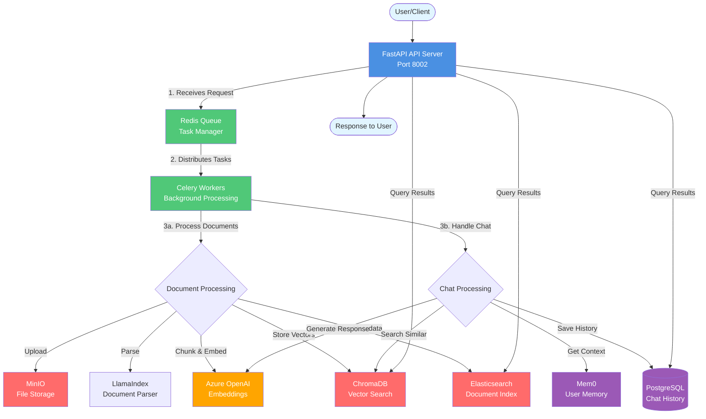
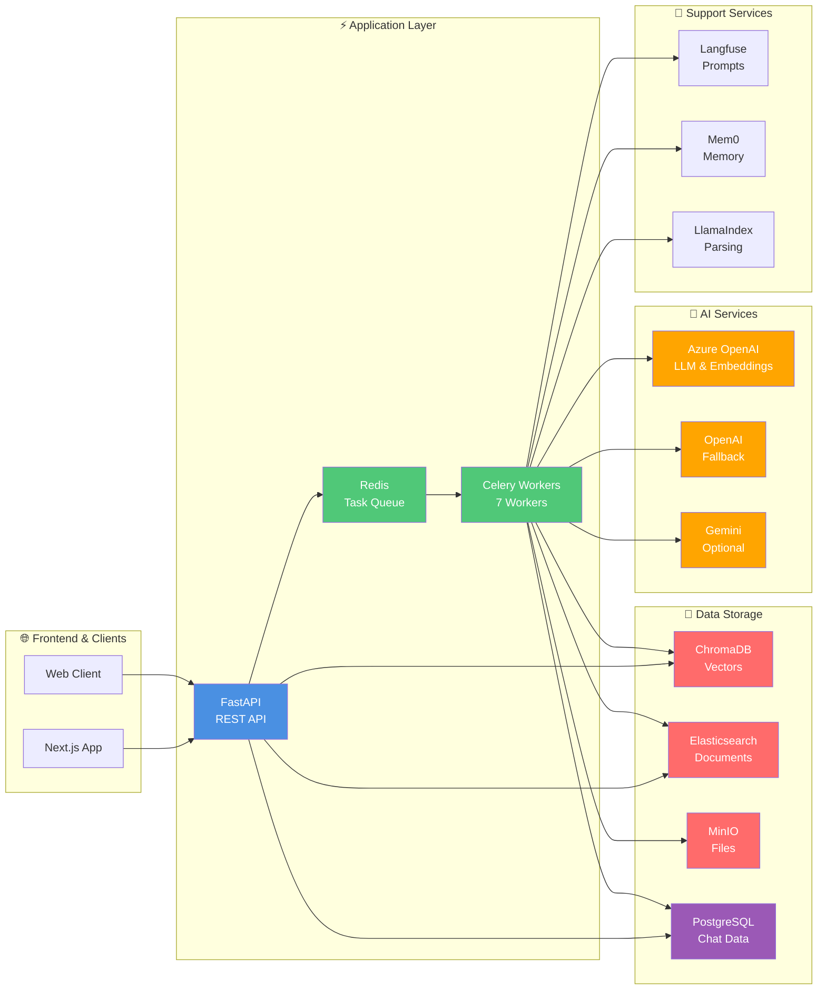

# Application Infrastructure Diagram - Simplified View

## Main Application Flow



## System Architecture - Component View



## How It Works - Step by Step

### 📄 Document Processing Pipeline

```
1. User uploads document
   ↓
2. FastAPI receives request
   ↓
3. Task sent to Redis queue
   ↓
4. Celery worker picks up task
   ↓
5. Document stored in MinIO
   ↓
6. Document parsed by LlamaIndex
   ↓
7. Text split into chunks
   ↓
8. Chunks converted to vectors (Azure OpenAI)
   ↓
9. Vectors stored in ChromaDB
   ↓
10. Metadata indexed in Elasticsearch
   ↓
11. Document ready for search!
```

### 💬 Chat/Query Pipeline

```
1. User asks a question
   ↓
2. FastAPI receives query
   ↓
3. System searches ChromaDB for similar content
   ↓
4. Retrieves relevant document chunks
   ↓
5. Gets user context from Mem0
   ↓
6. Fetches chat history from PostgreSQL
   ↓
7. Builds prompt with context
   ↓
8. Sends to Azure OpenAI for response
   ↓
9. Response saved to PostgreSQL
   ↓
10. Response returned to user
```

## Technology Stack Summary

| Category | Technology | Purpose |
|----------|-----------|---------|
| **API Framework** | FastAPI + Uvicorn | REST API server |
| **Task Queue** | Redis + Celery | Background job processing |
| **Vector Database** | ChromaDB | Store and search embeddings |
| **Document Search** | Elasticsearch | Index and search documents |
| **File Storage** | MinIO | Store uploaded files |
| **Database** | PostgreSQL | Chat history, user data |
| **AI Models** | Azure OpenAI / OpenAI / Gemini | LLM and embeddings |
| **Document Parsing** | LlamaIndex | Convert documents to text |
| **Prompt Management** | Langfuse | Manage and version prompts |
| **Memory** | Mem0 | Store user context and preferences |
| **Orchestration** | LangChain / LangGraph | Workflow management |

## Port Reference

| Service | Port | Access |
|---------|------|--------|
| FastAPI | 8002 | http://localhost:8002 |
| ChromaDB | 8001 | http://localhost:8001 |
| MinIO API | 9000 | http://localhost:9000 |
| MinIO Console | 9001 | http://localhost:9001 |
| Elasticsearch | 9200 | http://localhost:9200 |
| Kibana | 5601 | http://localhost:5601 |
| Flower | 5555 | http://localhost:5555 |
| Redis | 6379 | Internal only |


